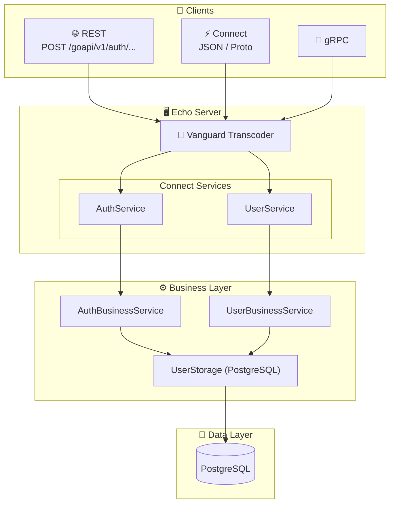

[](https://sonarcloud.io/summary/new_code?id=lao-tseu-is-alive_go-cloud-k8s-auth)
[](https://sonarcloud.io/summary/new_code?id=lao-tseu-is-alive_go-cloud-k8s-auth)
[](https://sonarcloud.io/summary/new_code?id=lao-tseu-is-alive_go-cloud-k8s-auth)
[](https://sonarcloud.io/summary/new_code?id=lao-tseu-is-alive_go-cloud-k8s-auth)
[](https://sonarcloud.io/summary/new_code?id=lao-tseu-is-alive_go-cloud-k8s-auth)
[](https://github.com/lao-tseu-is-alive/go-cloud-k8s-auth/actions/workflows/test.yml)
[](https://github.com/lao-tseu-is-alive/go-cloud-k8s-auth/actions/workflows/cve-trivy-scan.yml)
[](https://codecov.io/gh/lao-tseu-is-alive_/go-cloud-k8s-auth)


https://sonarcloud.io/summary/new_code?id=lao-tseu-is-alive_go-cloud-k8s-common-libs

# 🚀 go-cloud-auth

A modern **Proto-first** microservice for managing users and authentication — built with Go, gRPC, ConnectRPC, and designed for cloud-native Kubernetes deployments.

> **Proto as Source of Truth**: API contracts are defined in Protocol Buffers, generating both Go code and OpenAPI specs automatically. Clients can connect via REST, gRPC, or Connect protocols.

## ✨ Features

- 🔐 **OAuth2 Social Login** — Google, GitHub, and Microsoft AD authentication
- 👤 **User Management** — Auto-upsert profiles on login and standard CRUD support
- 🔑 **JWT Signing & Verification** — Cryptographically signs and validates user session tokens
- 🛡️ **Role-Based Access Control (RBAC)** — Simple role checks (admin, user) with group support
- 📡 **Multi-Protocol Support** — REST, gRPC, and Connect (JSON/Proto) via [Vanguard transcoding](https://github.com/connectrpc/vanguard-go)
- 🐘 **PostgreSQL Backend** — Robust data persistence with pgx driver and database migrations
- 🐳 **Container Ready** — Optimized Docker images with CVE scanning via Trivy
- ☸️ **Kubernetes Native** — Ready for K8s deployment with health checks, metrics, and Prometheus support

---

## 🏗️ Architecture



---

## 📦 Proto-First API Design

The API is defined using **Protocol Buffers** as the single source of truth:

```
proto/auth/v1/
└── auth.proto                 # AuthService & UserService definitions
```

### Generated Artifacts

| Source | Generated | Purpose |
|--------|-----------|---------|
| `.proto` files | `gen/auth/v1/*.go` | Go types & gRPC stubs |
| `.proto` files | `gen/auth/v1/authv1connect/*.go` | Connect handlers |
| `.proto` files | `api/openapi/auth.swagger.yaml` | OpenAPI 2.0 spec |

### Regenerate Code

```bash
./scripts/buf_generate.sh
# or
buf generate
```

---

## 🔌 API Endpoints

All endpoints are prefixed with `/goapi/v1` and require JWT authentication (except public OAuth endpoints: `StartOAuth`, `OAuthCallback`, and `ValidateToken`).

### Authentication Resources (AuthService)

| Method | Endpoint | Description | Public / Secured |
|--------|----------|-------------|------------------|
| `POST` | `/goapi/v1/auth/start` | Initiates OAuth flow (Google, GitHub, Microsoft) | **Public** |
| `POST` | `/goapi/v1/auth/callback` | Exhanges authorization code for signed JWT | **Public** |
| `POST` | `/goapi/v1/auth/validateToken` | Verifies a JWT token's validity | **Public** |
| `GET` | `/goapi/v1/auth/currentUser` | Returns details of the currently logged-in user | **Secured** |

### User Resources (UserService)

| Method | Endpoint | Description | Public / Secured |
|--------|----------|-------------|------------------|
| `GET` | `/goapi/v1/user` | List users with pagination | **Secured** |
| `POST` | `/goapi/v1/user` | Create a user | **Secured (Admin)** |
| `GET` | `/goapi/v1/user/{id}` | Get user details by UUID | **Secured** |
| `PUT` | `/goapi/v1/user/{id}` | Update a user's details | **Secured (Admin)** |
| `DELETE` | `/goapi/v1/user/{id}` | Delete a user by UUID | **Secured (Admin)** |
| `GET` | `/goapi/v1/user/count` | Count total users in the DB | **Secured** |
| `GET` | `/goapi/v1/user/by-external-id/{external_id}` | Retrieve a user by their legacy integer ID | **Secured** |

### Connect RPC Endpoints

```bash
# Connect JSON format
curl -X POST http://localhost:9090/auth.v1.UserService/List \
  -H "Content-Type: application/json" \
  -H "Authorization: Bearer $TOKEN" \
  -d '{"limit": 10}'
```

---

## 🚀 Configuration & Testing Guide

This section explains how to configure, run, and test the `go-cloud-k8s-auth` authentication and user management service.

### 📋 Prerequisites
- **Go 1.25+**
- **PostgreSQL 14+** (with a database named `go_cloud_auth`)
- **buf** CLI (to regenerate proto files if you edit them) [The Buf CLI home page](https://buf.build/product/cli)

---

### ⚙️ Step 1: Environment Configuration

Create a `.env` file at the root of the project by copying [.env_sample](file:///home/cgil/cgdev/golang/go-cloud-k8s-auth/.env_sample):
```bash
cp .env_sample .env
```

Adapt the variables to your setup. For OAuth2 providers, here is how to register an application to get credentials:

#### GitHub OAuth Setup
1. Go to **Settings > Developer Settings > OAuth Apps > New OAuth App** on GitHub.
2. Set **Homepage URL** to `http://localhost:9090`.
3. Set **Authorization callback URL** to `http://localhost:9090/` (since our frontend SPA handles the redirection parameters).
4. Register the app, generate a Client Secret, and configure `.env`:
   ```env
   # Google
   OAUTH_GOOGLE_CLIENT_ID="your_google_client_id"
   OAUTH_GOOGLE_CLIENT_SECRET="your_google_client_secret"
   OAUTH_GOOGLE_REDIRECT_URL="http://localhost:9090/"

   # GitHub
   OAUTH_GITHUB_CLIENT_ID="your_github_client_id"
   OAUTH_GITHUB_CLIENT_SECRET="your_github_client_secret"
   OAUTH_GITHUB_REDIRECT_URL="http://localhost:9090/"

   # Microsoft Azure AD
   OAUTH_MICROSOFT_CLIENT_ID="your_microsoft_client_id"
   OAUTH_MICROSOFT_CLIENT_SECRET="your_microsoft_client_secret"
   OAUTH_MICROSOFT_REDIRECT_URL="http://localhost:9090/"
   ```

---

### 🚀 Step 2: Start the Server

1. Install dependencies:
   ```bash
   go mod download
   ```
2. Start the server (migrations will auto-apply to the configured PostgreSQL database on startup):
   ```bash
   go run ./cmd/goCloudAuthServer
   ```
   *Alternatively, you can run `make run` if your environment has the variables exported.*

---

### 🧪 Step 3: Testing the OAuth2 Authentication Flow

Since OAuth2 requires browser interaction to authenticate the user, you can test the flow using `curl` and your browser.

#### 1. Initiate the OAuth Flow
Ask the service to generate the authorization URL for your chosen provider (e.g., `github`):
```bash
curl -X POST http://localhost:9090/goapi/v1/auth/start \
  -H "Content-Type: application/json" \
  -d '{"provider": "github"}'
```
**Response**:
```json
{
  "authUrl": "https://github.com/login/oauth/authorize?client_id=...&redirect_uri=...&state=...",
  "state": "random_anti_csrf_token_here"
}
```

#### 2. Authenticate in Browser
Copy the `authUrl` from the response and paste it into your browser. 
Once you log in and authorize the app on GitHub, your browser will redirect to the callback URL, which will look like:
`http://localhost:9090/goapi/v1/auth/callback?code=AUTH_CODE&state=STATE_TOKEN`

#### 3. Complete the Callback
Vanguard transcodes this callback automatically. Exchange the `code` and `state` to retrieve your signed JWT and user info:
```bash
curl -X POST http://localhost:9090/goapi/v1/auth/callback \
  -H "Content-Type: application/json" \
  -d '{
    "provider": "github",
    "code": "AUTH_CODE_FROM_URL",
    "state": "STATE_TOKEN_FROM_URL"
  }'
```
**Response**:
```json
{
  "jwt": "eyJhbGciOi...",
  "user": {
    "id": "user-uuid-v4-here",
    "externalId": 1234567,
    "email": "user@example.com",
    "name": "User Name",
    "avatarUrl": "https://avatars.githubusercontent.com/...",
    "provider": "github",
    "roles": ["user"]
  }
}
```
*Note: The user is automatically upserted (created or updated) in PostgreSQL during this callback.*

---

### 🔐 Step 4: Accessing Secured API Endpoints

Once you have your JWT token, store it in a variable:
```bash
export JWT_TOKEN="eyJhbGciOi..."
```

#### 1. Get Current User info
```bash
curl -H "Authorization: Bearer $JWT_TOKEN" \
  http://localhost:9090/goapi/v1/auth/currentUser
```

#### 2. Validate the Token
```bash
curl -X POST http://localhost:9090/goapi/v1/auth/validateToken \
  -H "Content-Type: application/json" \
  -d "{\"token\": \"$JWT_TOKEN\"}"
```

#### 3. List Users (Requires JWT)
```bash
curl -H "Authorization: Bearer $JWT_TOKEN" \
  http://localhost:9090/goapi/v1/user
```

#### 4. Create User (Admin required or user creation)
```bash
curl -X POST http://localhost:9090/goapi/v1/user \
  -H "Authorization: Bearer $JWT_TOKEN" \
  -H "Content-Type: application/json" \
  -d '{
    "user": {
      "email": "test-user@example.org",
      "name": "Test User",
      "roles": ["user"]
    }
  }'
```

---

## 💻 Example ConnectRPC Client

We provide a fully functional example ConnectRPC client in [cmd/exampleClient](file:///home/cgil/cgdev/golang/go-cloud-k8s-auth/cmd/exampleClient/main.go) to demonstrate how your cloud-native services can connect to and query this auth microservice in Go.

The client demonstrates:
1. ConnectRPC client instantiation for both `AuthService` and `UserService`.
2. Setting up a client-side unary interceptor to inject a JWT Bearer token into outgoing requests.
3. Performing token validation, retrieving current user profile, and listing users.

### Build the Example Client

```bash
make build-example-client
```

### Run the Example Client

Ensure the server is running (e.g. `go run ./cmd/goCloudAuthServer`), then run the client commands:

#### 1. Initiate OAuth Login Flow
Generates a login link for a provider (defaults to `github`):
```bash
./bin/exampleClient -cmd start-oauth -provider github
# or via make
make run-example-client ARGS="-cmd start-oauth -provider github"
```

#### 2. Validate a JWT Token
```bash
./bin/exampleClient -cmd validate -token "YOUR_JWT_TOKEN"
```

#### 3. Fetch Currently Logged-in User Profile
This requires the token to be sent in the request authorization headers via client interceptor:
```bash
./bin/exampleClient -cmd current-user -token "YOUR_JWT_TOKEN"
```

#### 4. List Registered Users
Queries the user service (requires admin rights or appropriate JWT token roles):
```bash
./bin/exampleClient -cmd list-users -token "YOUR_JWT_TOKEN" -limit 5
```

---

### 🧪 Run Automated Tests

To execute tests:

# Start the server
go run ./cmd/goCloudAuthServer
```

### Run Tests

```bash
make test
```

---

## 🐳 Docker

### Pull from GitHub Container Registry

```bash
docker pull ghcr.io/lao-tseu-is-alive/go-cloud-k8s-auth:latest
```

### Build Locally

```bash
docker build -t go-cloud-k8s-auth .
```

Find all available versions in the [Packages section](https://github.com/lao-tseu-is-alive/go-cloud-k8s-auth/pkgs/container/go-cloud-k8s-auth).

---

## 📚 Documentation

- 📋 [Requirements](./documentation/Requirements.md) — Functional and system requirements
- 🔐 [OAuth2 Providers Setup](./documentation/oauth_providers_setup.md) — Detailed guide to configure Google, GitHub, and Microsoft credentials
- 🔗 [OpenAPI Spec (YAML)](./api/openapi/go_cloud_auth.yaml) — Generated from proto

---

## 🛠️ Tech Stack

| Category | Technology |
|----------|------------|
| **Language** | Go 1.21+ |
| **API Framework** | [Echo](https://echo.labstack.com/) |
| **RPC** | [ConnectRPC](https://connectrpc.com/) + [Vanguard](https://github.com/connectrpc/vanguard-go) |
| **Proto Tooling** | [buf](https://buf.build/) |
| **Database** | PostgreSQL with [pgx](https://github.com/jackc/pgx) |
| **Auth** | JWT via [cristalhq/jwt](https://github.com/cristalhq/jwt) |
| **Monitoring** | Prometheus metrics |
| **Container** | Docker with multi-stage builds |
| **Security** | [Trivy](https://aquasecurity.github.io/trivy/) CVE scanning |

---

## 📁 Project Structure

```
go-cloud-k8s-auth/
├── proto/
│   └── auth/v1/                 # 📋 Proto definitions (source of truth)
├── api/
│   └── openapi/                 # 📄 Generated OpenAPI specs
├── cmd/
│   └── goCloudAuthServer/       # 🚀 Main application entry point
├── gen/
│   └── auth/v1/                 # ⚙️ Generated Go code from protos
├── pkg/
│   ├── auth/                    # 📦 Authentication & User services
│   │   ├── auth_service.go      # OAuth and token business logic
│   │   ├── user_service.go      # User CRUD business logic
│   │   ├── auth_connect_server.go # ConnectRPC auth handlers
│   │   ├── user_connect_server.go # ConnectRPC user handlers
│   │   ├── storage.go           # Storage interfaces
│   │   ├── storage_postgres.go  # PostgreSQL operations (pgx)
│   │   ├── auth_interceptor.go  # JWT validation interceptor
│   │   ├── mappers.go           # Domain ↔ Proto conversion stubs
│   │   ├── state_store.go       # Safe in-memory anti-CSRF store
│   │   └── errors.go / messages.go # Domain validation & error constants
│   └── rbac/                    # 🛡️ Role-Based Access Control
│       ├── enforcer.go          # RBAC interface
│       └── simple_enforcer.go   # Admin & User static rules
├── db/migrations/               # 🗃️ SQL migrations
└── scripts/                     # 🔧 Build & generation scripts
```

---

## 🔒 Security

- All CVE scans performed automatically before container builds
- JWT authentication required for all `/goapi/v1/*` endpoints
- SonarCloud analysis for code quality and security
- Dependabot for dependency updates

---

## 📄 License

MIT License — See [LICENSE](./LICENSE) for details.

---

<p align="center">
  Built with ❤️ using Go, Proto, and Connect
</p>
