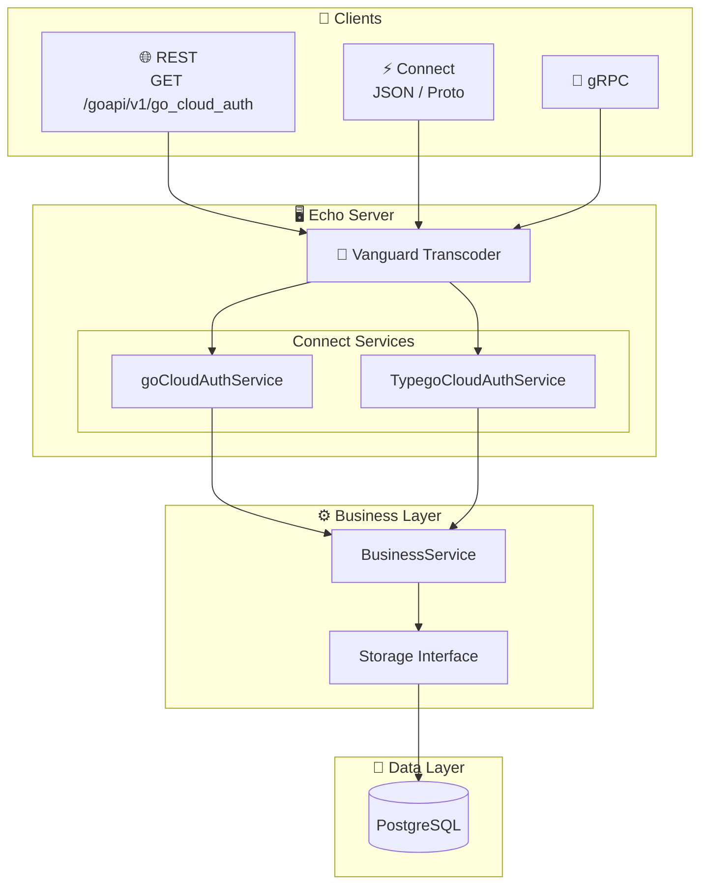

[](https://sonarcloud.io/summary/new_code?id=your-github-account_go-cloud-auth)
[](https://sonarcloud.io/summary/new_code?id=your-github-account_go-cloud-auth)
[](https://sonarcloud.io/summary/new_code?id=your-github-account_go-cloud-auth)
[](https://sonarcloud.io/summary/new_code?id=your-github-account_go-cloud-auth)
[](https://https://github.com/lao-tseu-is-alive/go-cloud-k8s-auth/actions/workflows/test.yml)
[](https://https://github.com/lao-tseu-is-alive/go-cloud-k8s-auth/actions/workflows/cve-trivy-scan.yml)
[](https://codecov.io/gh/your-github-account/go-cloud-auth)

# 🚀 go-cloud-auth

A modern **Proto-first** microservice for managing "goCloudAuths" — built with Go, gRPC, ConnectRPC, and designed for cloud-native Kubernetes deployments.

> **Proto as Source of Truth**: API contracts are defined in Protocol Buffers, generating both Go code and OpenAPI specs automatically. Clients can connect via REST, gRPC, or Connect protocols.

## ✨ Features

- 🔐 **JWT Authentication** — Secure endpoints with token-based auth from [go-cloud-k8s-user-group](https://github.com/lao-tseu-is-alive/go-cloud-k8s-user-group)
- 📡 **Multi-Protocol Support** — REST, gRPC, and Connect (JSON/Proto) via [Vanguard transcoding](https://github.com/connectrpc/vanguard-go)
- 📋 **Proto-First Design** — Single source of truth for API definitions
- 🐘 **PostgreSQL Backend** — Robust data persistence with pgx driver
- 🐳 **Container Ready** — Optimized Docker images with CVE scanning via Trivy
- ☸️ **Kubernetes Native** — Ready for K8s deployment with health checks and metrics

---

## 🏗️ Architecture



---

## 📦 Proto-First API Design

The API is defined using **Protocol Buffers** as the single source of truth:

```
api/proto/go_cloud_auth/v1/
├── go_cloud_auth.proto           # goCloudAuthService definitions
└── type_go_cloud_auth.proto      # TypegoCloudAuthService definitions
```

### Generated Artifacts

| Source | Generated | Purpose |
|--------|-----------|---------|
| `.proto` files | `gen/go_cloud_auth/v1/*.go` | Go types & gRPC stubs |
| `.proto` files | `gen/go_cloud_auth/v1/go_cloud_authv1connect/*.go` | Connect handlers |
| `.proto` files | `api/openapi/go_cloud_auth.yaml` | OpenAPI 3.0 spec |

### Regenerate Code

```bash
./scripts/buf_generate.sh
# or
buf generate api/proto
```

---

## 🔌 API Endpoints

All endpoints are prefixed with `/goapi/v1` and require JWT authentication.

### goCloudAuth Resources

| Method | Endpoint | Description |
|--------|----------|-------------|
| `GET` | `/goapi/v1/go_cloud_auth` | List go_cloud_auths |
| `POST` | `/goapi/v1/go_cloud_auth` | Create a go_cloud_auth |
| `GET` | `/goapi/v1/go_cloud_auth/{id}` | Get go_cloud_auth by ID |
| `PUT` | `/goapi/v1/go_cloud_auth/{id}` | Update a go_cloud_auth |
| `DELETE` | `/goapi/v1/go_cloud_auth/{id}` | Delete a go_cloud_auth |
| `GET` | `/goapi/v1/go_cloud_auth/search` | Search go_cloud_auths |
| `GET` | `/goapi/v1/go_cloud_auth/count` | Count go_cloud_auths |
| `GET` | `/goapi/v1/go_cloud_auth/geojson` | Get GeoJSON |

### TypegoCloudAuth Resources

| Method | Endpoint | Description |
|--------|----------|-------------|
| `GET` | `/goapi/v1/types` | List type go_cloud_auths |
| `POST` | `/goapi/v1/types` | Create type go_cloud_auth |
| `GET` | `/goapi/v1/types/{id}` | Get type go_cloud_auth by ID |
| `PUT` | `/goapi/v1/types/{id}` | Update type go_cloud_auth |
| `DELETE` | `/goapi/v1/types/{id}` | Delete type go_cloud_auth |
| `GET` | `/goapi/v1/types/count` | Count type go_cloud_auths |

### Connect RPC Endpoints

```bash
# Connect JSON format
curl -X POST http://localhost:9090/go_cloud_auth.v1.goCloudAuthService/List \
  -H "Content-Type: application/json" \
  -H "Authorization: Bearer $TOKEN" \
  -d '{"limit": 10}'
```

---

## 🚀 Quick Start

### Prerequisites

- Go 1.21+
- PostgreSQL 14+
- [buf](https://buf.build/docs/installation) (for proto generation)

### Environment Variables

```bash
# Required
export PORT=9090
export DB_HOST=localhost
export DB_PORT=5432
export DB_NAME=go_cloud_auth
export DB_USER=your_user
export DB_PASSWORD=your_password
export JWT_SECRET=your_jwt_secret
export ADMIN_PASSWORD=your_admin_password
```

### Run Locally

```bash
# Install dependencies
go mod download

# Run database migrations
# (migrations are auto-applied on startup)

# Start the server
go run ./cmd/goCloudAuthServer
```

### Run Tests

```bash
make test
```

---

## 🐳 Docker

### Pull from GitHub Container Registry

```bash
docker pull ghcr.io/your-github-account/go-cloud-auth:latest
```

### Build Locally

```bash
docker build -t go-cloud-auth .
```

Find all available versions in the [Packages section](https://https://github.com/lao-tseu-is-alive/go-cloud-k8s-auth/pkgs/container/go-cloud-auth).

---

## 📚 Documentation

- 📋 [Requirements](./documentation/Requirements.md) — Functional and system requirements
- 🔗 [OpenAPI Spec (YAML)](./api/openapi/go_cloud_auth.yaml) — Generated from proto

---

## 🛠️ Tech Stack

| Category | Technology |
|----------|------------|
| **Language** | Go 1.21+ |
| **API Framework** | [Echo](https://echo.labstack.com/) |
| **RPC** | [ConnectRPC](https://connectrpc.com/) + [Vanguard](https://github.com/connectrpc/vanguard-go) |
| **Proto Tooling** | [buf](https://buf.build/) |
| **Database** | PostgreSQL with [pgx](https://github.com/jackc/pgx) |
| **Auth** | JWT via [cristalhq/jwt](https://github.com/cristalhq/jwt) |
| **Monitoring** | Prometheus metrics |
| **Container** | Docker with multi-stage builds |
| **Security** | [Trivy](https://aquasecurity.github.io/trivy/) CVE scanning |

---

## 📁 Project Structure

```
go-cloud-auth/
├── api/
│   ├── proto/go_cloud_auth/v1/          # 📋 Proto definitions (source of truth)
│   └── openapi/                  # 📄 Generated OpenAPI specs
├── cmd/
│   └── goCloudAuthServer/   # 🚀 Main application entry point
├── gen/
│   └── go_cloud_auth/v1/                # ⚙️ Generated Go code from protos
├── pkg/
│   └── go_cloud_auth/                   # 📦 Business logic
│       ├── business_service.go  # Core business operations
│       ├── connect_server.go    # Connect RPC handlers
│       ├── mappers.go           # Domain ↔ Proto conversion
│       └── storage_postgres.go  # Database operations
├── db/migrations/               # 🗃️ SQL migrations
├── scripts/                     # 🔧 Build & generation scripts
└── documentation/               # 📚 Requirements & docs
```

---

## 🔒 Security

- All CVE scans performed automatically before container builds
- JWT authentication required for all `/goapi/v1/*` endpoints
- SonarCloud analysis for code quality and security
- Dependabot for dependency updates

---

## 📄 License

MIT License — See [LICENSE](./LICENSE) for details.

---

<p align="center">
  Built with ❤️ using Go, Proto, and Connect
</p>
